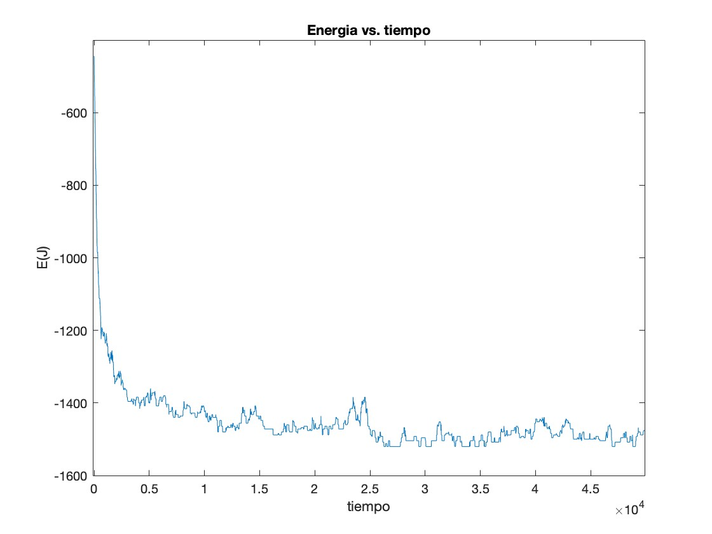
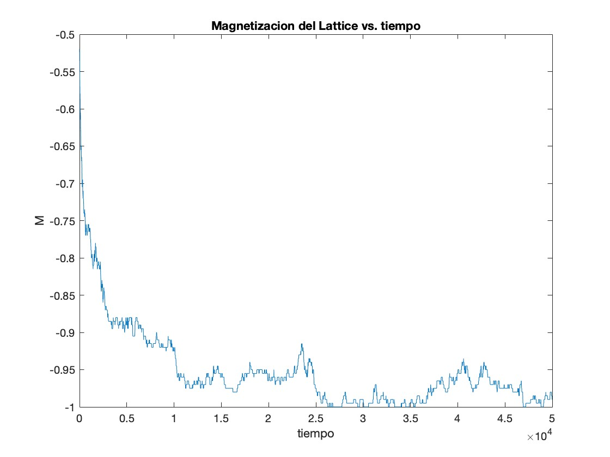
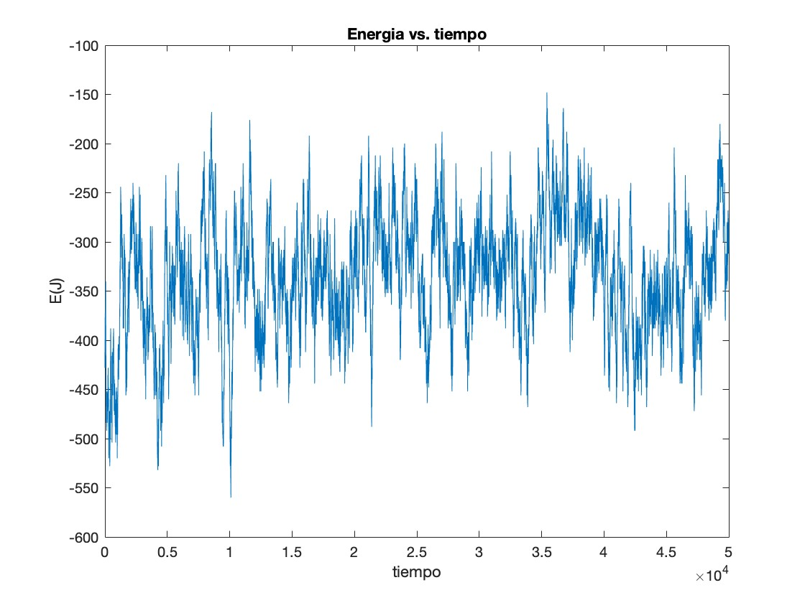
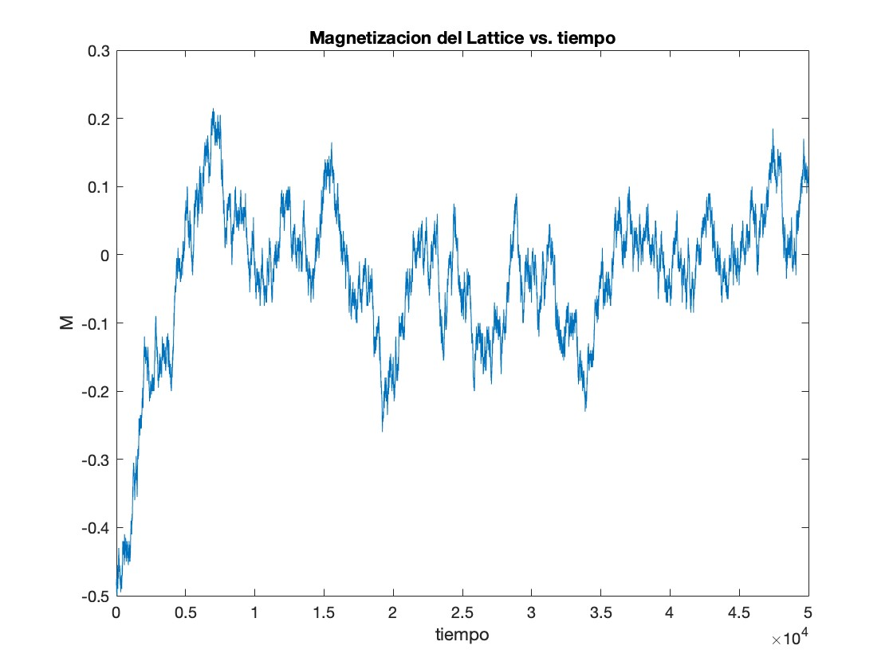
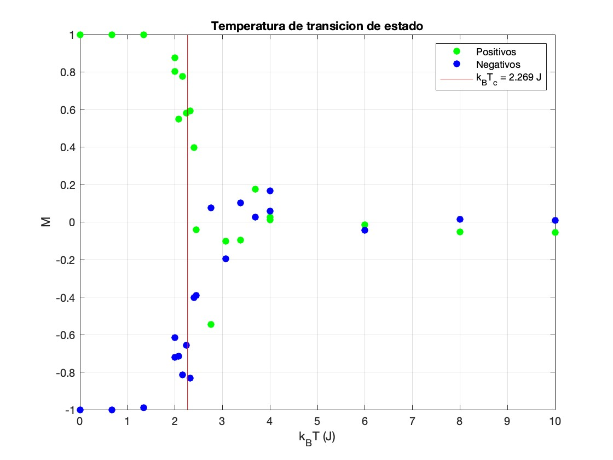
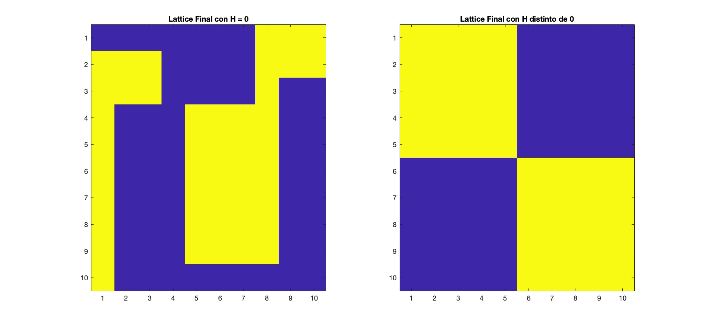
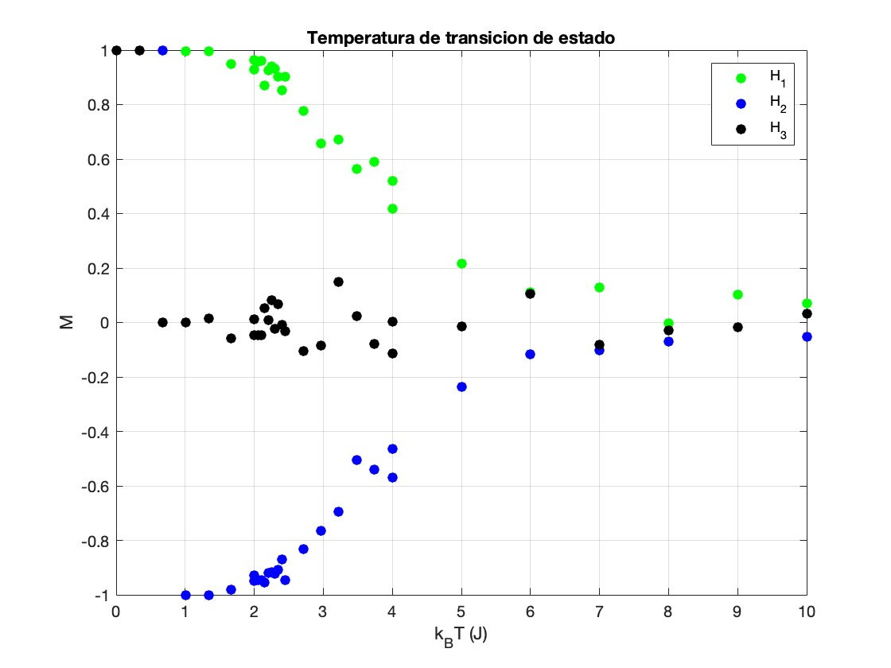
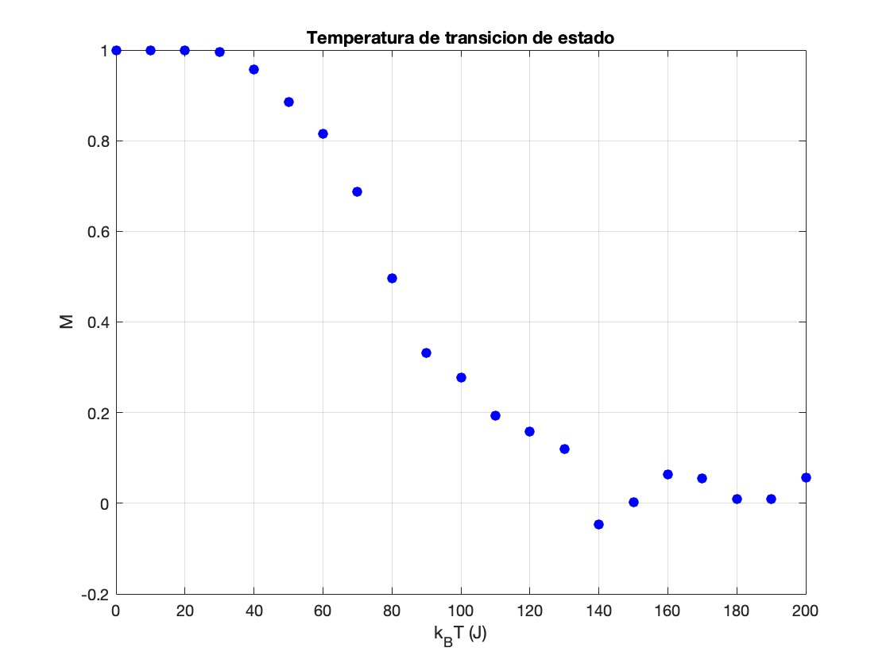

# Theoretical Introduction
The 2D Ising Model allows us to analyze the behavior of a magnetic lattice. Each element of the lattice represents the spin of a particle $\sigma$, which can only take be +1 or -1. The Ising Model proposes the following Hamiltonian for the system

$$H = -\sum_{<i,j>}J\sigma_i\sigma_j - \sum_ih_i\sigma_i$$

This model takes into account two contributions for the energy, one from internal interactions represented by the first term, and another from the interaction of the lattice with an external magnetic field. The value of the constant J determines whether the spins tend to align with each other ($J>0$) or not ($J<0$). 
The first objective of the project is to analyze the evolution of the system for a given temperature and in the absence of external magnetic fields. We define the magnetization of a lattice of $N$ spins, denoted by $M$, as:

$$M = \frac{1}{N}\sum_i^N\sigma_i$$

According to the 2nd Law of Thermodynamics, one would expect the system to evolve into the macrostate which has the largest number of microstates associated with it, which in this case would be $M=0$. However, this will not always be the case. If for instance, the initial configuration of the lattice has most spins aligned, and the temperature is low, with a positive value of $J$, it is more likely for the system to evolve into a configuration where most of its elements are completely aligned. The reason for this is that under certain circumstances, the macrostate with the largest number of microstates associated may have a greater energy than that of the initial cases. If this is coupled with a low temperature, it will be more likely for the system to reach a state with lower energy which corresponds to having more spins aligned. Nonetheless, this indicates that there exists a temperature at which the behavior of the system shifts from having a strong total magnetization to reaching the state $M=0$. Such a temperature is called the critical temperature.
Finally, we ought to comment about the detailed balanced condition, since it will be applied in the next section. The detailed balance condition determines that for a system to be in equilibrium, the probability for the system to leave the equilibrium state (call it $\mu$) has to be equal to the probability of arriving at the equilibrium state from all other possible states $\nu$. This condition can be expressed as

$$\sum_\nu p(\mu) P(\mu\rightarrow\nu) = \sum_\nu p(\nu)P(\nu\rightarrow\mu)$$

where $p(\mu)$ is the probability of finding the state in the microstate $\mu$ and $P(\mu\rightarrow\nu)$ the probability of going from state $\mu$ to state $\nu$. The possible microstates for a given energy $E_\mu$ follow a Boltzmann distribution

$$p(\mu) = e^{-\beta E(\mu)/Z}$$

with $\beta = 1/k_BT$ is inversely proportional to the temperature and Boltzmann's constant. Finally, Z is the partition function, which guarantees that the sum of probabilities for each microstate is normalized. Nevertheless, calculating the sums expressed in the detailed balanced condition can be challenging from a computation perspective, since it can significantly increase the execution time of the simulation. To avoid this, we guarantee that the condition is met by imposing that the terms from each of the sums are equal to each other

$$p(\mu) P(\mu\rightarrow\nu) = \sum_\nu p(\nu)P(\nu\rightarrow\mu)$$

which implies that the ratio of probabilities of going from one state to another or vice verse is given by

$$\frac{P(\mu\rightarrow\nu)}{P(\nu\rightarrow\mu)} = \frac{p(\nu)}{p(\mu)} = e^{-\beta(E_\nu-E_\mu)}$$

# Numerical Methods
In this project, we shall use a Metropolis algorithm to simulate the evolution of a given lattice. To better understand the evolution of the system, we can break it up into three steps. 

1. First we create a lattice and define the temperature bathit will be submerged in. We denote by $\mu$ the initial microstate with an associated energy $E_\mu$. This is done by the function [createLattice](https://github.com/juanmsa3006/Simulation-of-the-2D-Ising-Model/blob/main/createLattice.m).
2. We randomly flip a spin in the lattice and denote the resulting microstate by $\nu$ and its associated energy by $E_\nu$. We will impose that the system always evolves into the most stable state of the two.
   (a). If $E_\nu<E\nu$ then $P(\mu\rightarrow\nu) = 1$, and the lattice evolves into the $\nu$ state. I
   (b). If $E_\nu>E_\mu$, then for the balanced detailed condition to be met we must evolve into the new state $\nu$ with a probability $P(\mu\rightarrow\nu) = e^{-\beta(E_\nu-E_mu)}$
3. We repeat the process for a given number of iterations.

This algorithm is also called the Wolff algorithm. Next, we will explain the main purposes of the functions used in the project
- The [createLattice] function generates a random matrix with a given magnetization. To do so each element in the matrix has a chance of being +1 or -1, according to a certain probability which is passed as a parameter to the function
along with the size of the lattice.
- The function [energy](https://github.com/juanmsa3006/Simulation-of-the-2D-Ising-Model/blob/main/energy.m) calculates the energy for a given lattice. To simplify the sum, for each element in the lattice, we define a kernel, which is a matrix
with the same dimensions as the lattice, but which has every element set to 0, except for the elements neighboring the selected element of the lattice, which are set to 1. If we represent the lattice by a matrix $L$, the kernel associated to the
the $(i,j)$ element of $L$ as $K^{(i,j)}$, then the energy contribution from internal interactions simply becomes

$$\sum_{\text{all }i,j}L_{i,j}(L.*K^{(i,j)})$$

  where $.*$ denotes the element-wise product and returns a matrix of the same size as $L$, and each element $(m,l)$ of a given kernel $K^{(i,j)}$ is defined as

$$K_{m,l}^{(i,j)} =
    \begin{cases}
      1 & \text{, if } (k,l) \text{ is a neighbour of }(i,j) \\
      0 & \text{, otherwise}
    \end{cases}
$$

  The function also calculates the contribution due to an external magnetic field, which is passed as a parameter of the function, along with both lattices. The magnetic field is represented by a matrix of the same dimensions as the lattice, 
  and a value at each point to represent the strength and orientation of the magnetic field in that given spot.

- The function [energyDif](https://github.com/juanmsa3006/Simulation-of-the-2D-Ising-Model/blob/main/energyDif.m) is used to calculate the energy difference between to states without having to first calculate the energy of both lattices. This
function is used during the evolution simulation. Since in each step, only one spin is altered, we can calculate the difference in energies between the new and old lattices without the need to calculate the individual energy of each
lattice. This helps reduce computational time.
- The [extraHamil](https://github.com/juanmsa3006/Simulation-of-the-2D-Ising-Model/blob/main/extraHamil.m) function does a similar job to the [energy](https://github.com/juanmsa3006/Simulation-of-the-2D-Ising-Model/blob/main/energy.m) function, with the difference that the Hamiltonian used is one which takes into
account long-range interactions, instead of the one proposed by the Ising Model.
- The [runIsingModel](https://github.com/juanmsa3006/Simulation-of-the-2D-Ising-Model/blob/main/runIsingModel.m) and [runIsingModelVariant](https://github.com/juanmsa3006/Simulation-of-the-2D-Ising-Model/blob/main/runIsingModelVariant.m) functions take an initial lattice, temperature, magnetic field and time steps, and run the algorithm until the given number of iterations is reached. The first version utilizes the
Ising Model Hamiltonian, while the second one uses the long-range interactions Hamiltonian.

The files [test1](https://github.com/juanmsa3006/Simulation-of-the-2D-Ising-Model/blob/main/test1.m) and [test2](https://github.com/juanmsa3006/Simulation-of-the-2D-Ising-Model/blob/main/test2.m) are the first two simulations ran. In both cases, and for the rest of the project (unless stated otherwise), we shall work with [J = 1J], and control the temperature by varying the value of $\beta = (k_BT)^{-1}$. 
In both tests, we shall work with 20x20 lattices, with 75% of the spins in the initial lattice being spin down, and we shall evolve the system through $5\cdot10^4$ time steps. The difference between tests 1 and 2, shall then be the temperature
bath the system is exposed to. For the first test, we set $\beta = 0.8J^{-1}$, and obtain the following results

## Energy vs. Time

## Magnetization vs. Time

What we can see in the graph is what we predicted earlier. If the temperature is low and the initial configuration has a strong magnetization, the system will tend to a macrostate which is strongly magnetized and therefore has a lower energy. 
However, we now repeat the simulation in test 2 with a higher temperature value $\beta = 0.2J^{-1}$, then the results we obtain are the following ones

## Energy vs. Time

## Magnetization vs. Time

We see that for a higher temperature, the state reached by the system is radically different to the one we obtained before. 

# Phase Shift Temperature

As we mentioned before, we know that as the temperature increases, the final state achieved by the system changes drastically from a macrostate with a strong magnetization to a macrostate with an average magnetization of approximately 0. To
find the temperature at which this sudden shift in the evolution of the system occurs, we utilize a loop that runs the evolution of the model for a series of values of increasing temperature and records the final magnetization achieved 
by the system and we later plot the final magnetization reached by the system against the temperature. This is done in the [TransitionT](TrasitionT.m) script. For this section we once again work with 20x20 lattices, but each simulation will run for $10^5$ time steps. The values
of the temperature will range from $k_BT = 0.01 J$ to $k_BT = 10J$, and we shall run the model for 20 different values of the temperature in that range. We do this process with a lattice which starts with a total magnetization of 
$M = +1$ and one with a total magnetization of $M=-1$. The results obtained are the following

As we can see there is a sudden shift in the final magnetization achieved by the system for a value of $k_BT$ around $2J$. The red line represents the analytical solution obtained by Lars Onsager in 1942. 

# Adding a Magnetic field and varying the temperature
In this section, we study how the addition of an external magnetic field can affect the results we obtained in the previous section. The interaction with an external magnetic field is encoded in the second term of the Hamiltonian, where $h_i$ denotes the value of the field at the cell $i$. As we can see, the greater the alignment between the magnetic field and the spins in the lattice, the lower the energy and the more stable the system will be. So far we have seen how, for large enough temperatures, the system will tend to evolve into the macrostate with the highest number of microstates associated, in this case, the macrostate with $M=0$. As the number of microestates associated with a macrostate increases, the probability for reaching a particular microstate for a given macrostate goes down. However, by including a magnetic field, states that allign with this field become more likely to occur. In the script [testB](testB.m) we introduce a
magnetic field with an arbitrary pattern, initialize a random 10x10 lattice with 50% of its cells having spin up and the other half having spin down, and observe how the system evolves after $10^5$ time steps. In this case, the temperature is
set to $\beta = 5J^{-1}$, to make it more likely for the system to reach the lowest possible energy state. In the following graphs, we present the final lattices obtained for two simulations with the same initial conditions, except for the 
fact that the first evolves without the presence of a magnetic field, whereas the second one does have a magnetic field.

## No Magnetic Field Left, Arbitrary Magnetic Field Right

In the graph, spin up corresponds to yellow cells, while purple cells represent spin down. As we can see, the presence of a magnetic field can allow us to greatly influence and make certain microstates significantly more stable and therefore more likely to be obtained.
We can also ask ourselves how does the presence of the magnetic field affect the phase shift of the system. To answer this question we repeat the process of the previous section, with the addition of an external magnetic field. This is done in the [TransitionTB](TransitionTB.m) script. In this test, we work with 20x20 lattices which will start with all of its cells having spin up. In this case, we will take 30 $k_BT$ values in the same range as before. The test is performed three times for three different magnetic fields: $H_1$ is aligned with spin +1 at every point, $H_2$ is aligned with spin -1 at every point and $H_3$ is aligned with spin +1 in its top half and with spin -1 in its bottom half. The results
obtained are the following ones

## Phase Shift in the Presence of External Magnetic Field

We can get two main conclusions from this result. The first is that the addition of a magnetic field converts the phase shift from an abrupt to a continuous process, and it becomes much harder to define a phase shift temperature in this case.
At the same time, we see that for low temperatures the lattices tend to allign with the magnetic fields, and it is only when high temperatures are reached (even higher than in the case with no magnetic fields) that the  behavior of the system shifts. This makes sense since the addition of magnetic fields could make certain states even more stable than they already were, which would imply that more energy and hence higher temperatures would be required to escape them.

# Long Range Interactions
Finally, we propose a variation to the Ising Model. As it has previously been discussed, the Ising Model Hamiltonian only considers close interactions between the spins of a lattice. We could, however, consider a Hamiltonian which
took into account the interactions between all spins of the lattice, and where the strength of such an interaction would be inversely proportional to the distance between the two spins. In that case, we could write the Hamiltonian as

$$
H = -\sum_{<i,j>}J\frac{\sigma_i\sigma_j}{d(\sigma_i,\sigma_j)} - \sum_ih_i\sigma_i
$$

Where $d(\sigma_i,\sigma_j)$ is some defined function which measures determines how the strength of the interaction decays with the distance. There are multiple ways to define this dependence on the strength of the interaction with the distance, but we shall consider only the most basic case where we shall define the distance function between two elements $L_{i,j}$ and $L_{m,l}$ of a given lattice $L$ as
$$
d(L_{i,j},L_{m,l}) = \sqrt{(i-m)^2+(j-l)^2}
$$
The calculation of the energy according to this new Hamiltonian is carried out by the [extraHamil](extraHamil.m) function. We now test the effects of this new model and see how the addition of long-range interactions affects the phenomenon of phase shift, this is done in the [TransitionH](TrasitionT.m) script. We once again repeat the same process, with a 15x15 lattice, with an initial magnetization $M=+1$, we run $10^3$ time steps for each given temperature and record the final magnetization reached by the system. To run
simulations with the new Hamiltonian we use the [runIsingModelVarint](runIsingModelVariant.m) script. We will range the temperature $k_BT$ from $0.001J$ up to $200J$ taking 21 values. We obtain the following results

## Phase Shift for Long-Range Interactions Model

It can quickly be observed that the phenomenon is no longer abrupt but seems to be continuous, and what is more interesting, is that the temperatures required to observe a change in the behavior of the system are significantly higher. This last fact can potentially be explained if we realize that by allowing greater interaction between the cells of the lattice, certain alterations of the system that go against the global tendency of the lattice will require a significant amount of extra energy to take place, and will therefore be less likely. Meanwhile, under the Hamiltonian proposed in the Ising Model, each spin followed the local tendency, which even allowed for a given lattice to have different regions with different local magnetizations. This would be highly unlikely under the new Hamiltonian, and this may explain why a disorganized microstate requires significantly more energy than before.

